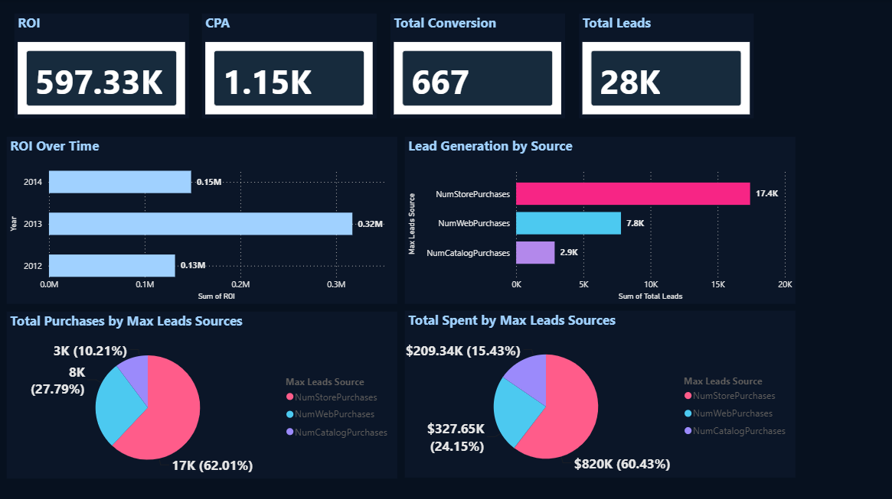
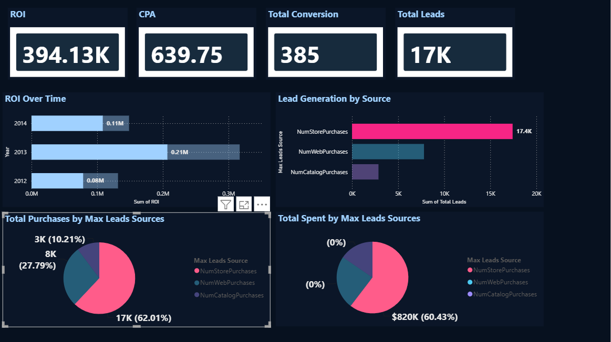
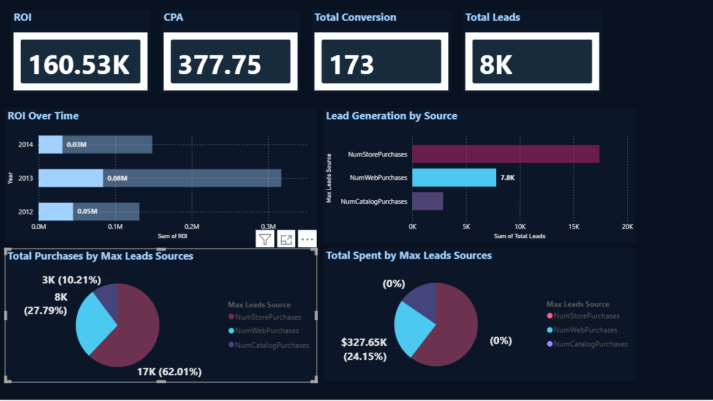
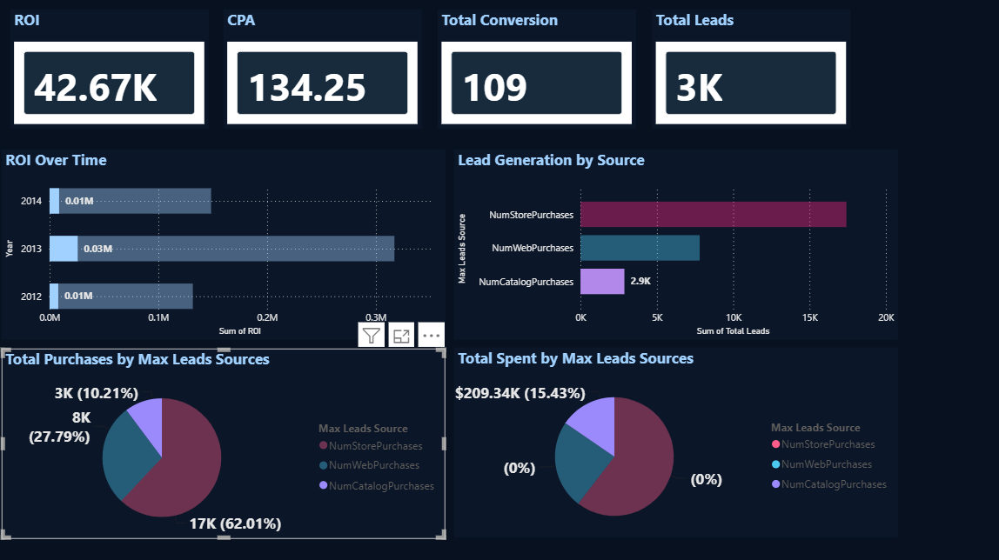

# 📊 Marketing Campaign Effectiveness Analysis & Power BI Dashboard

> End-to-end marketing analytics project using Python, Pandas and Power BI.

## 📊 Project Overview


This project analyzes customer and marketing campaign data to evaluate campaign effectiveness and generate business insights.

The project combines Python-based data cleaning, transformation and analysis with a data processing pipeline and an interactive Power BI dashboard.

The analysis focuses on key marketing metrics such as:

- ROI (Return on Investment)
- CPA (Cost Per Acquisition)
- Total Conversions
- Conversion Rate
- Total Leads
- Purchase Channels
- Customer Spending
- Campaign Performance

---

## 🎯 Project Objective

The main objective of this project is to evaluate marketing campaign performance using customer, purchase and campaign-response data.

The analysis focuses on:

1. Measuring campaign ROI
2. Calculating Cost Per Acquisition (CPA)
3. Evaluating campaign conversions
4. Measuring lead generation
5. Analyzing customer purchasing behavior
6. Understanding customer spending
7. Comparing marketing performance
8. Building an interactive Power BI dashboard
### Store Purchases

Store purchases were the highest among the purchase channels, indicating that customers showed a strong preference for purchasing through physical stores.
### Web Purchases



Web purchases were the second highest among the different purchase channels, showing that customers preferred the online shopping channel. This analysis helps identify customer purchasing behavior and the importance of the web channel.
### Catalog Purchases


Catalog purchases were the lowest among the purchase channels, indicating relatively lower customer engagement through the catalog channel compared with store and web purchases.

---

## 🛠️ Tools & Technologies

- Python
- Pandas
- NumPy
- Matplotlib
- Jupyter Notebook
- Power BI
- Power Query
- Excel
- CSV

---

## 🔄 Project Workflow

```text
Raw Data
   ↓
Data Cleaning
   ↓
Data Filtering
   ↓
Data Transformation
   ↓
Feature Engineering
   ↓
KPI Calculation
   ↓
Data Processing Pipeline
   ↓
Processed Dataset
   ↓
Power BI
   ↓
Interactive Dashboard
   ↓
Business Insights
## 🛠️ Tools & Technologies

- Python
- Pandas – data cleaning, filtering and transformation
- NumPy – numerical data processing
- Matplotlib – data analysis and visualization
- Power BI – interactive dashboard creation
- Jupyter Notebook – data analysis

## 🔄 Project Workflow

Raw Data → Data Cleaning → Data Filtering → Data Transformation → Data Processing Pipeline → Analysis → Power BI Dashboard
## 🎯 Project Objective

The main objective of this project is to evaluate marketing campaign performance and identify key factors affecting conversions, leads, ROI and customer acquisition.

## 💡 Key Insights

- Analyzed marketing campaign performance using customer and campaign data.
- Calculated key metrics such as ROI, CPA, conversions and total leads.
- Identified the strongest lead sources based on campaign performance.
- Compared marketing spend and purchases across different lead sources.
- Built an interactive Power BI dashboard to present the findings visually.
## 📊 Dashboard Highlights

- ROI: 597.33K
- CPA: 1.15K
- Total Conversions: 667
- Total Leads: 28K


